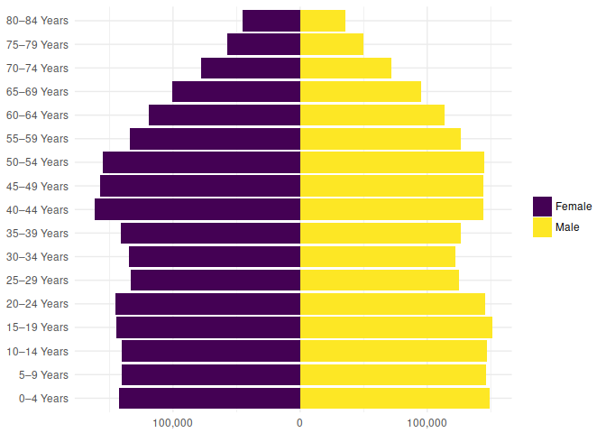

<!-- README.md is generated from README.Rmd. Please edit that file -->
nzcensus2013
============

The `nzcensus2013` R package contains a single dataset, `nzcensus2013`, of all the data in the [spreadsheet file](http://www.stats.govt.nz/Census/2013-census/data-tables/electorate-tables.aspx) of summary statistics from the 2013 New Zealand Census, published by Statistics New Zealand.

This package is not associated with the New Zealand government.

The data was extracted from the spreadsheet by using the [tidyxl](https://nacnudus.github.io/tidyxl) and [unpivotr](https://nacnudus.github.io/unpivotr) packages, after first converting the `.xls` file to the `.xlsx` format. See the script [`data-raw/extract.R`](https://github.com/nacnudus/nzcensus2013/blob/master/data-raw/extract.R).

A similar package, [nzcensus](https://github.com/ellisp/nzelect), wraps the finer-grained meshblock-level data. An advantage of the aggregate data in `nzcensus2013` is that certain totals and aggregations have been performed by Stats NZ themselves, *before* random rounding, so that they are more accurate than home-brewed aggregations on the randomly-rounded meshblock data. The meshblock data in `nzcensus` has many advantages, too, so ... horses for courses.

Installation
------------

You can install nzcensus2013 from github with:

``` r
# install.packages("devtools")
devtools::install_github("nacnudus/nzcensus2013")
```

Example
-------

``` r
library(nzcensus2013)
suppressPackageStartupMessages(library(tidyverse))
library(stringr)
suppressPackageStartupMessages(library(scales))
library(naturalsort)

plotdata <-
  nzcensus2013 %>%
  filter(title == "Age group and sex",
         dimensions == "By general electorate",
         population == "For the census usually resident population count",
         col_header1 == "Sex",
         row_header1 == "Age group and general electorate",
         row_header2 == "Total New Zealand",
         str_detect(row_header3, "Years$")) %>%
  select(sex = col_header2, age = row_header3, population = value) %>%
  mutate(population = if_else(sex == "Male", population, -population),
         age = as_factor(age, naturalsort(unique(age))))

plotdata %>%
  ggplot(aes(age, population, fill = sex)) +
    geom_bar(stat = "identity") +
    coord_flip() +
    scale_fill_viridis_d(name = "") +
    scale_y_continuous(labels = function(x) comma(abs(x))) +
    theme_minimal() +
    theme(axis.title.x = element_blank(),
          axis.title.y = element_blank())
```



Other New Zealand datasets by the same author:
----------------------------------------------

-   [nzpullover](https://nacnudus.github.io/nzpullover) -- road policing statistics, updated quarterly.
-   [nzlifetables](https://github.com/nacnudus/nzlifetables) -- cohort life tables
-   [nzbabynames](https://github.com/nacnudus/nzbabynames) -- the top 100 baby names annually since 1954, and annual birth statistics.
